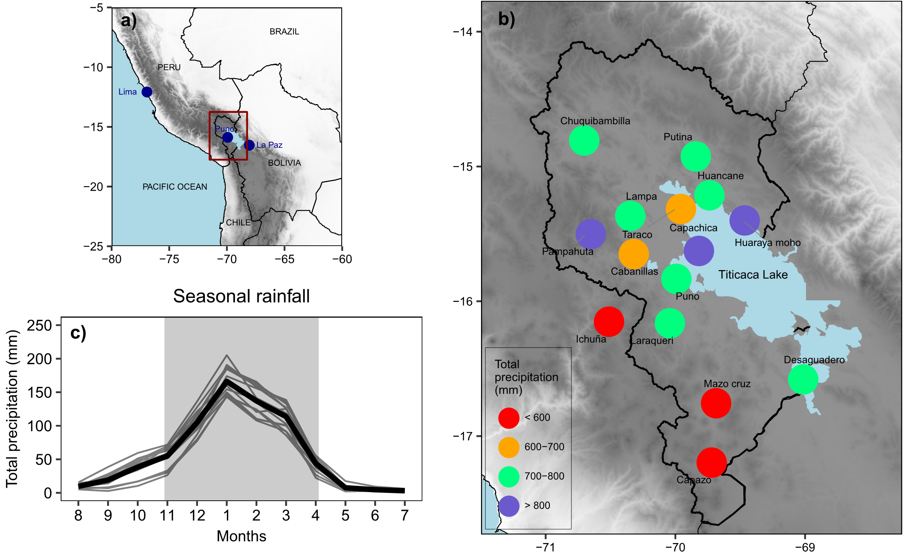

# EPIs_PA
Trends and variability of precipitation extremes in the Peruvian Altiplano (1971–2013)

### Abstract

Precipitation extremes have been investigated throughout the last decades in different regions of the Andes. However, little attention has been paid to the Altiplano region (Central Andes), especially to the Peruvian Altiplano (PA) that represents a complex area and is highly vulnerable to extreme events, such as floods and droughts, driven by the strong variability of precipitation. This study focuses on the analysis of 11 extreme precipitation indices (EPIs) in the period 1971–2013. In this context, commonly used statistical trend and break analyses were applied and a false discovery procedure was used in order to reduce the number of artificial significant tests. Additionally, the relative dominance of precipitation frequency and intensity in interannual precipitation datasets was determined. Finally, the correlation between EPIs and six oceanic‐atmospheric indices were analysed. The results indicate that there is no significant global trend towards wet or dry conditions in the PA, although a signal of a more slightly decrease of precipitation is presented in the Southern PA. Additionally, interannual variability of total precipitation is mainly dominated by precipitation frequency. The Central Tropical Pacific sea surface temperature plays a major role for the maximum and average length of wet periods as well as for total precipitation. This finding is particularly relevant for the southwestern PA. Our results have important implications for risk management and adaptation planning related to extreme hydrological events in the PA.

  

*Figure 1. (a) Overview of the Andes with the study area in red. (b) Study area of the PA (Titicaca Lake basin in black line) and location of the 15 climatological stations with coloured long-term annual mean precipitation in 1971–2013. (c) Mean monthly precipitation (the thin lines represent individual stations, the thick black line indicates the average and the grey area corresponds to the rainy months)*

### Code

This represents my first attempt of code in my early years with R (~2014-2015). At that time, my code style was not so good (it is obvious just by looking at the code :D). However, I did perform many analyses. The code is divided into two folders: datos_originales (where is established the observed dataset y figure 1) and data_NDEFMA (where the paper and the rest of the figures are done). The most valuable script could be the [EPIs](https://github.com/adrHuerta/EPIs_PA/blob/master/Code/data_NDEFMA/functions/funciones_indices_extremos_pp_v3_06092015.R). In those years, there was not any available package in that topic, but now I would recommend: [ClimIndVis](https://github.com/Climandes/ClimIndVis/), [climdex.pcic](https://github.com/pacificclimate/climdex.pcic/), and many others.

### Reference

Huerta, A, Lavado‐Casimiro, W. Trends and variability of precipitation extremes in the Peruvian Altiplano (1971–2013). International Journal of Climatology. 2020; 1–16.[https://doi.org/10.1002/joc.6635](https://doi.org/10.1002/joc.6635).